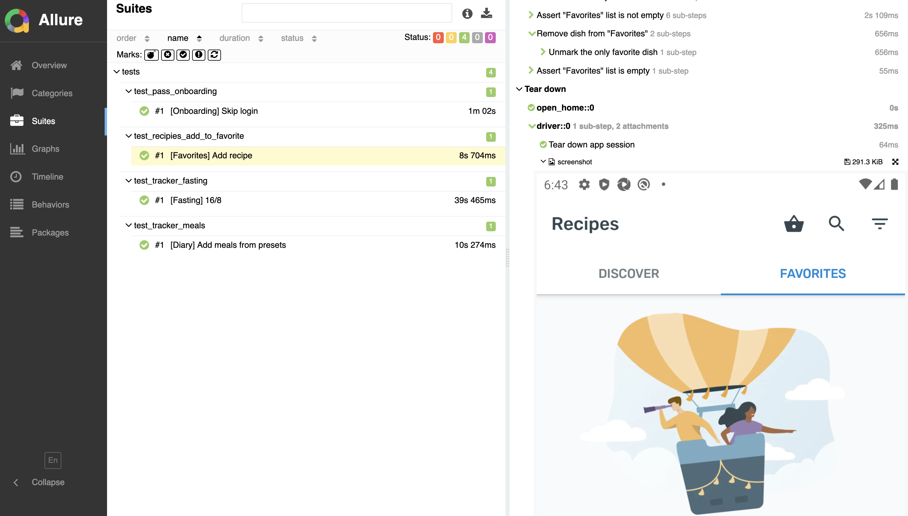

# <p align="center"> UI mobile automation project <a href="https://www.yazio.com/en"> YAZIO </a></p>
<p align="center">
    
</p>

## Contents

>  [Technology Stack](#technology-stack)
>
>  [Covered Functionality](#covered-functionality)
>
>  [Allure Report](#allure-report)
>
>  [Test Run Record Example](#test-run-record-example)

## Technology Stack and Instruments
<p  align="center">
    <code></code>
    <code></code>
    <code></code>
    <code></code>
    <code></code>
    <code></code>
    <code></code>
    <code></code>
    <code></code>
    <code></code>
</p>

## Covered Functionality 
#### UI tests check:

* ✅ Pass onboarding
* ✅ Add meals to diary
* ✅ Start, stop and cancel fasting tracker
* ✅ Add recipe to favorites and delete


## Run tests locally

Local run requires [Python](https://www.python.org/downloads/release/python-3126/)
and [Poetry](https://python-poetry.org/docs/#installation) installed.

1. Download the project and `cd` to its directory
2. In project root create virtual environment and install dependencies

```bash
python3 -m venv .venv && source .venv/bin/activate
poetry install --no-root
```

3. In project root create `resources` directory and put the app `.apk` file into it.  


4. Run tests

```bash
pytest --context local
```

When run is finished `allure-results` directory will be generated in project root. If Allure Report is [installed](https://allurereport.org/docs/install/), a report can be generated
```bash
allure serve allure-results
```

## Allure Report
Clicking on the Allure Report link we get a full overview of finished run.
It includes:
- Summary
<p align="center">
    
</p> 

- Detailed steps of each test and screenshot
<p align="center">
    
</p>  


## Test Run Record Example
<p align="center">
    
    
</p>
<p align="center">
    
    
</p>